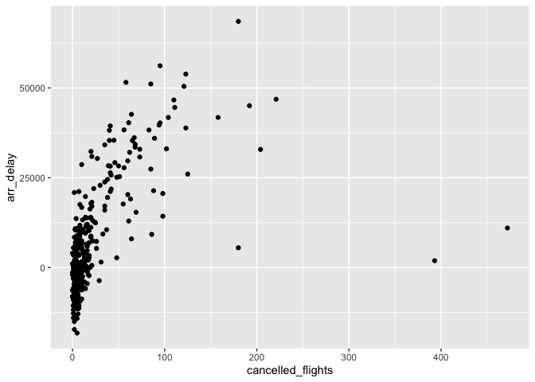

homework-02
================
Chun Pong Brian Chan
9/27/2021

## Question 1

``` r
count(flights, is.na(dep_time))
```

    ## # A tibble: 2 x 2
    ##   `is.na(dep_time)`      n
    ##   <lgl>              <int>
    ## 1 FALSE             328521
    ## 2 TRUE                8255

``` r
count(flights, is.na(dep_delay))
```

    ## # A tibble: 2 x 2
    ##   `is.na(dep_delay)`      n
    ##   <lgl>               <int>
    ## 1 FALSE              328521
    ## 2 TRUE                 8255

``` r
count(flights, is.na(arr_time))
```

    ## # A tibble: 2 x 2
    ##   `is.na(arr_time)`      n
    ##   <lgl>              <int>
    ## 1 FALSE             328063
    ## 2 TRUE                8713

``` r
count(flights, is.na(arr_delay))
```

    ## # A tibble: 2 x 2
    ##   `is.na(arr_delay)`      n
    ##   <lgl>               <int>
    ## 1 FALSE              327346
    ## 2 TRUE                 9430

``` r
count(flights, is.na(tailnum))
```

    ## # A tibble: 2 x 2
    ##   `is.na(tailnum)`      n
    ##   <lgl>             <int>
    ## 1 FALSE            334264
    ## 2 TRUE               2512

``` r
count(flights, is.na(air_time))
```

    ## # A tibble: 2 x 2
    ##   `is.na(air_time)`      n
    ##   <lgl>              <int>
    ## 1 FALSE             327346
    ## 2 TRUE                9430

``` r
##sum(is.na.data.frame(flights))
```

I am quite sure these are quite self-explanatory with the name of the
variable. It means the nnumber of rows that are missing.

## Question 2

``` r
transmute(flights, 
          dep_time, 
          minute = ((dep_time %/% 100) * 60) + (dep_time %% 100))
```

    ## # A tibble: 336,776 x 2
    ##    dep_time minute
    ##       <int>  <dbl>
    ##  1      517    317
    ##  2      533    333
    ##  3      542    342
    ##  4      544    344
    ##  5      554    354
    ##  6      554    354
    ##  7      555    355
    ##  8      557    357
    ##  9      557    357
    ## 10      558    358
    ## # … with 336,766 more rows

## Question 3

``` r
flights2 <- flights %>%
  group_by(year, month, day) %>%
  summarize(cancelled_flights = sum(is.na(dep_delay)),
            arr_delay = sum(arr_delay, na.rm = TRUE))
```

    ## `summarise()` has grouped output by 'year', 'month'. You can override using the `.groups` argument.

``` r
ggplot(flights2, aes(x = cancelled_flights, y = arr_delay)) + geom_point()
```

<!-- -->
