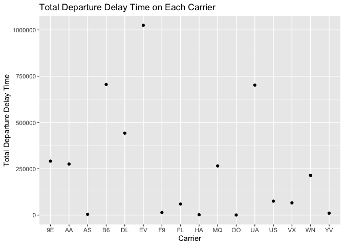
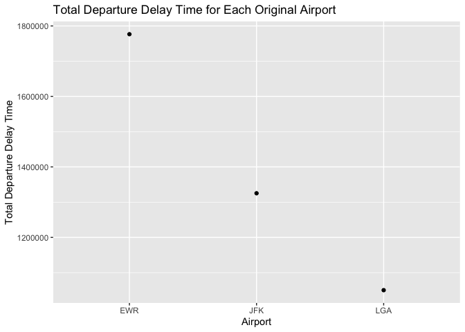
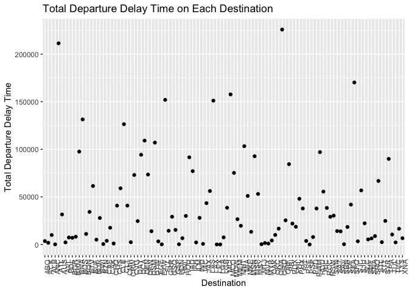

homework-03
================
Chun Pong Brian Chan
10/04/2021

## 1

``` r
flights2 <- flights %>%
  group_by(dep_time) %>%
  summarise(dep_delay = sum(dep_delay, na.rm = TRUE), arr_delay = sum(arr_delay, na.rm = TRUE)) %>%
  arrange(dep_delay, arr_delay)
head(flights2)
```

    ## # A tibble: 6 x 3
    ##   dep_time dep_delay arr_delay
    ##      <int>     <dbl>     <dbl>
    ## 1      555     -4338     -7938
    ## 2      554     -4026     -6705
    ## 3      553     -3767     -6046
    ## 4      556     -3466     -7585
    ## 5      654     -2848     -8116
    ## 6      557     -2799     -6097

With this result, I believe the best time to avoid delay is around 6am
in the morning since it takes less time the the schedule time to arrive,
that is why it has a negative value for both depature and arrival delay.

## 2a

``` r
flights2 <- flights %>%
  group_by(carrier) %>%
  summarise(dep_delay = sum(dep_delay, na.rm = TRUE), arr_delay = sum(arr_delay, na.rm = TRUE))

ggplot(flights2, aes(carrier, dep_delay)) +
  labs(title = "Total Departure Delay Time on Each Carrier", 
       y = "Total Departure Delay Time", 
       x = "Carrier") + 
  geom_point() 
```

<!-- --> There
are certain carrier has way higher total departure delay time, which are
EV, B6, and UA, customers that use these three airlines are more likely
to experience departure delay than those that using other airlines.

## 2b

``` r
flights2 <- flights %>%
  group_by(origin) %>%
  summarise(dep_delay = sum(dep_delay, na.rm = TRUE), arr_delay = sum(arr_delay, na.rm = TRUE))

ggplot(flights2, aes(origin, dep_delay)) +
  labs(title = "Total Departure Delay Time for Each Original Airport", 
       y = "Total Departure Delay Time", 
       x = "Airport") + 
  geom_point()
```

<!-- --> The most
likely EWR airport has the highest chance of delaying flights than other
airports.

## 2c

``` r
flights2 <- flights %>%
  group_by(dest) %>%
  summarise(dep_delay = sum(dep_delay, na.rm = TRUE), arr_delay = sum(arr_delay, na.rm = TRUE)) %>%
  arrange(dep_delay)

ggplot(flights2, aes(dest, dep_delay)) +
  labs(title = "Total Departure Delay Time on Each Destination", 
       y = "Total Departure Delay Time", 
       x = "Destination") + 
  theme(axis.text.x = element_text(angle=90, hjust=1))+
  geom_point()
```

<!-- --> ORD,
ATL, and SFO has the highest total departure delay time among all the
airports in the states. I believe one of the reasons is that these three
airports are the biggest airports in the states, which means that they
need to handle a lot more flights than a lot of the other airports in
comparison, which makes them have a higher chance of delaying their
flights.
